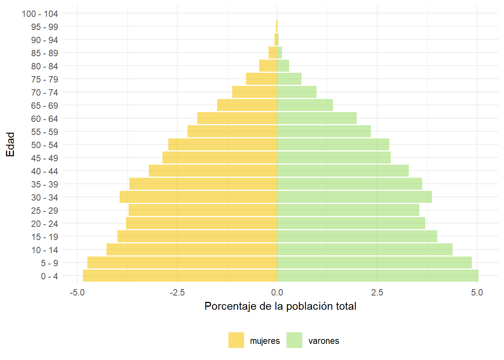
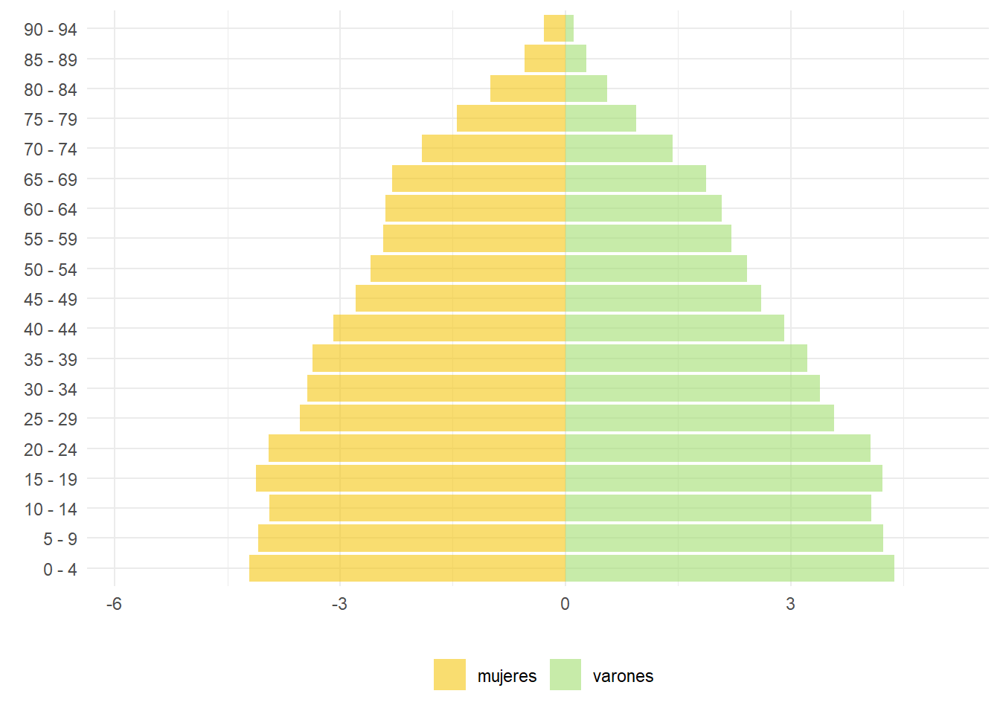

---
title: "**<br /> <br /> Indicadores demográficos del Uruguay**"
output:
  html_document:
    toc: true
    toc_float: true
    toc_depth: 1
---

<script>
  $(document).ready(function() {
    $head = $('#header');
    $head.prepend('')
  });
</script>


```{r setup, include=FALSE}
knitr::opts_chunk$set(echo = FALSE, warning = FALSE, message = FALSE)
```


```{r}
suppressPackageStartupMessages(library(tidyverse))
suppressPackageStartupMessages(library(plotly))
suppressPackageStartupMessages(library(ggplot2))
suppressPackageStartupMessages(library(DT))
suppressPackageStartupMessages(library(kableExtra))
suppressPackageStartupMessages(library(gganimate))
suppressPackageStartupMessages(library(gapminder))
suppressPackageStartupMessages(library(Rcpp))

base        <- readxl::read_excel("Data/Base Motor Demografica 29 julio.xls")


```

<br />
<br />

<div style="text-align: justify">
La [Unidad de Métodos y Acceso a Datos](https://umad.cienciassociales.edu.uy/) (UMAD) (FCS-UdelaR) a partir del [Observatorio Uruguay](https://umad.cienciassociales.edu.uy/observatorio-uruguay/) busca aportar a la difusión de conocimiento respecto a temas de interés general sobre la realidad social, económica y política del Uruguay. Esta serie de documentos tiene como objetivo presentar indicadores clave para el análisis de tendencias históricas del país que esperamos sean de utilidad para las comunidades académicas, los tomadores de decisión y los formadores de opinión, así como el público en general.

La información contenida en este reporte busca brindar información sobre las principales variables que determinan el cambio demográfico. Se buscar presentar la información de forma sencilla, definiendo algunos conceptos básicos, los indicadores más utilizados y la forma en que deben ser interpretados. Se busca a su vez ilustrar la evolución mediante gráficos sencillos y fáciles de intepretar. Se trata de un acercamiento muy básico  que podrá ser útil tanto a estudiantes que se inician en la materia como a comunicadores y  periodistas que buscan comprender los asuntos relacionados a los temas demográficos.

La información acerca de la población se expresa mejor en términos de números y tasas. No basta saber que la esperanza de vida está aumentando. ¿Cuántos años más? ¿Durante qué período ha tenido lugar el cambio? ¿Quiénes se han visto afectados? ¿Qué proporción de la población representan? Tal información tiene mucho más significado cuando sirve para indicar la magnitud y la distribución del fenómeno, así como la tendencia. Para que sean útiles, los datos deben expresarse clara y precisamente. A menudo se confunden las tasas de natalidad con las tasas de crecimiento; un descenso en las tasas de crecimiento a menudo se iguala equivocadamente a una disminución del tamaño de la población.

La demografía es el estudio científico de la población. Los demógrafos buscan descubrir los niveles y las tendencias en el tamaño de la población y sus componentes. Buscan explicaciones de los cambios demográficos y lo que ello implica para las sociedades. Utilizan censos, registros de nacimientos y defunciones, encuestas, registros de emisión de visas e incluso los de vehículos motorizados y las inscripciones estudiantiles. Esos datos se expresan en formatos manejables como la enumeración, tasa o razón.

</div>

<br />

# Herramientas básicas

<br />
<div style="text-align: justify">

En este reporte serán definidas la mayoría de las medidas principales utilizadas en demografía.

**Enumeración:** Refiere al número absoluto de una población o de cualquier evento demográfico que ocurre en una zona específica en un determinado período de tiempo. (Por ejemplo: La población de Montevideo según el censo de 1996 era 1.342.304 ; o  hubo 37.460 nacidos vivos en Uruguay en 2019). Las cifras brutas de los eventos demográficos forman la base para todos los demás análisis y estudios estadísticos.
  
**Tasa:** Es la frecuencia de los eventos demográficos acaecidos en una población durante un determinado período de tiempo (normalmente un año) dividida entre la población “a riesgo” de sufrir el evento durante ese período de tiempo. Las tasas indican cuán común es que suceda algún evento. (Por ejemplo, en Uruguay hubo 14.1  nacidos vivos  por cada 1.000 habitantes en 2015). La mayoría de las tasas se expresan por 1.000 habitantes. Las tasas brutas son tasas calculadas para una población completa. Las tasas específicas son tasas computadas para un subgrupo específico, normalmente la población que más se aproxima a la población “a riesgo” de que sufra el evento. (Por ejemplo, la tasa global de fecundidad es el número de nacimientos por cada 1.000 mujeres entre las edades de 15 a 49 años de edad.) Por lo tanto, pueden haber tasas por edad, sexo, raza, ocupación y así sucesivamente. En la práctica, es más correcto denominar algunos cálculos como razón y no tasa.

**Razón:** Es la relación entre un subgrupo de población y la población total u otro subgrupo; es decir, un subgrupo dividido por otro. (Por ejemplo, la razón de sexo en Rivera según el censo de 1996 era de 95.3 hombres por cada 100 mujeres.)

**Proporción:** Es la relación entre un subgrupo de población y toda la población; es decir, un subgrupo de población dividido por toda la población. (Por ejemplo, la proporción de la población menor de 15 años de Artigas según el censo de 2011 es de 25.9 por ciento.)

**Constante:** Es un número arbitrario que no cambia (por ejemplo, 100, 1.000 ó 100.000) por el que pueden multiplicarse una tasa, razón, o proporción para expresar estas medidas en forma más comprensible. Por ejemplo, en Uruguay en 2004 hubo  0.015325 nacidos vivos por persona.. Si se multiplica esta tasa por una constante (1.000) se obtiene el mismo resultado estadístico por cada 1.000 personas. Ésta es una forma más clara de expresar el mismo principio: hubo 15.3 nacidos vivos por cada 1.000 habitantes. En las fórmulas de las páginas siguientes, “K” significa constante.
 
**Medida de cohorte (mirada longitudinal):** Es una estadística que mide los eventos acaecidos a una cohorte (es decir, un grupo de personas que comparten una experiencia demográfica común) que se observa a través del tiempo. La cohorte utilizada más comunmente es la de nacimientos, es decir las personas nacidas durante el mismo año o período. Otros ejemplos de cohorte son la nupcialidad (los casados en tal año),  la cohorte escolar (los ingresados o egresados en tal año), etc."
 
**Medida durante un período (mirada transversal):** Es estadística que mide los eventos acaecidos a la totalidad o parte de una población durante un determinado período de tiempo. En efecto, esta medida “toma una instantánea” de la población. (Por ejemplo, la tasa de mortalidad en 2000 para la población uruguaya  fue de 9.2 por cada 1.000.).
 

</div>
  
<br />
  
# Tamaño y crecimiento de la población

<br />

<div style="text-align: justify">

El tamaño de la población refiere a la cantidad de personas (stock) que tienen su residencia en un territorio. Su contabilización suele realizarse a través de los censos de población (o a través de sistemas de registros o padrones de población donde se inscribe la población residente). Los censos de población son opertativos, de cobertura universal, que proporcionan una fotografía demográfica en un momento determinado.  Las personas son contabilizada en el censo de acuerdo a la modalidad censal. Un censo puede ser de Hecho (de Facto)  o de Derecho (de Jure). En un censo de Hecho, las personas son empadronadas en la unidad geográfica donde pernoctaron la noche anterior a la fecha del censo.  En los censos de Derecho las personas son empadronadas en la unidad geográfica donde residen habitualmente.

Los censos de 1963,1975, 1985 y 1996 fueron realizados bajo la modalidad censo de Hecho, y el conteo 2004 y el censo 2011 utilizaron la modalidad de Derecho.

Una comparación estricta para estimar el crecimiento demográfico debe ser realizada bajo la definción de residencia habitual, ya que si bien en los censos de Hecho se busca  la inamovilidad de las personas, ello no ocurre necesariamente y las cifras pueden verse afectadas. En particular, esto ocurre con las personas que trabajan el día del censo en un lugar diferente al de su residencia o debido a la movilidad con fines de esparcimiento en un día feriado.

Las cifras proporcionadas por los censos pueden adolescer de errores (omisiones o duplicaciones). La cuantificacón de dichos errores permite realizar una estimación de la población total del país a la fecha del censo y  la corrección de la población  que será utilizada como población de partida para la actualzación de las proyecciones futuras de población.   

</div>

<br />
    
    
<div style="text-align: center">
##### **Población total censada** 
```{r}
  periodo <- base[base$NOMINDICADOR == "Población total censada",]
  max<- max(periodo$FECHA)
  min<- min(periodo$FECHA)
  periodo <- c(min," - ", max)
  periodo_formatted <- paste(
    text_spec(periodo, color = 1, font_size = 16, align = "justify"),
    collapse = " ")
```
##### Total país, `r periodo_formatted`
</div>
    
## {.tabset .tabset-fade .tabset-pills}
### Gráfico
    
    
```{r, out.width='100%'}
#===============================================================================
  g1 <- 
    base %>% filter(NOMINDICADOR == "Población total censada") %>%
    mutate(VALOR = as.numeric(VALOR)) %>% 
    ggplot(aes(x = FECHA, y = VALOR)) +
    geom_line(aes(group = 1, color = NOMINDICADOR)) +
    geom_point(aes(color = NOMINDICADOR)) +
    scale_color_manual(
      values = c(639),
      labels = c("Cantidad")
    ) +
    ylim(0, 4000000) +
    xlim(1850, 2020) +
    
    theme_minimal() +
    labs(
      color = "",
      title = "",
      caption = "Unidad de Métodos y Acceso a Datos (UMAD)",
      x = "",
      y = ""
    )
  ggplotly(g1) %>% 
    config(displayModeBar = F) %>%
    layout(margin = list(b = 100), legend = list(x = 0.5, y = -0.1,orientation = "h", xanchor = "center" )) 
  
#===============================================================================
```


### Descargar Tabla

```{r}
  t1 <-   base %>% filter(NOMINDICADOR == "Población total censada") %>%
    mutate(VALOR = round(as.numeric(VALOR),1)) %>%
    rename(ANIO = FECHA)
  t1 <- t1 [,c("NOMINDICADOR","PAIS","ANIO","VALOR")]
  
  DT::datatable(t1, extensions =  'Buttons', options =  list(dom = 'Bfrtip',
                                                             buttons = c('copy', 'csv', 'excel', 'print') )
  ) 
``` 

##
<div style="text-align: left">
<font size=2>

Fuente: Unidad de Métodos y Acceso a Datos (UMAD) (FCS-UdelaR) con base en Censos de Población del Instituto Nacional de Estadística (INE). 

</font>
</div>


<br />

<div style="text-align: justify">

Los censos de población constituyen los pilares sobre los que se apoyan las proyecciones de población.  Para la realización de las proyecciones de población se utiliza la Ecuación Compensadora, que permite determinar el stock de población en un momento (Pf) como el stock en un momento  momento anterior (Pi), más los nacimientos (N) y la Inmigración (I), menos las defunciones (D) y la Emigración (E), ocurridas en entre los dos momentos considerados.

</div>


<div style="text-align: center">
$Pf = Pi + N - D + I - E$   (ocurridos entre i y f ) 
</div>

<div style="text-align: justify">

Cuanto mayor sea la calidad de las estadísticas vitales y migratorias, mayor será la calidad de la proyección obtenida.Los censos suelen tener algún nivel de omisión en su cobertura, la cual debe ser determinada para poder plantear correctamente el ejercicio de proyección.
</div>

<br />


<div style="text-align: center">
##### **Población censada y proyecciones de población** 
##### Total país, 1950-2011 
</div>

## {.tabset .tabset-fade .tabset-pills}
### Gráfico

```{r, out.width='100%'}
#===============================================================================
tabla        <- readxl::read_excel("Data/Tabla auxiliar proyecciones.xlsx")

  g1 <- 
    tabla %>%
    mutate(VALOR = as.numeric(VALOR)) %>% 
    ggplot(aes(x = ANIO, y = VALOR)) +
    geom_point(aes(color = DATO)) +
    scale_color_manual(
      values = c(639, "#a1dd70"),
      labels = c("Proy (NNUU 2019)", "Censos")
    ) +
    ylim(0, 4000) +
    xlim(1950, 2020) +
    
    theme_minimal() +
    labs(
      color = "",
      title = "",
      caption = "Unidad de Métodos y Acceso a Datos (UMAD)",
      x = "",
      y = ""
    )
  ggplotly(g1) %>% 
    config(displayModeBar = F) %>%
    layout(margin = list(b = 100), legend = list(x = 0.5, y = -0.1,orientation = "h", xanchor = "center" )) 

#===============================================================================
```


### Descargar Tabla

```{r}
  t1 <-   tabla %>% 
    mutate(VALOR = round(as.numeric(VALOR),1)) %>%
    rename(FUENTE = DATO)
  t1 <- t1 [,c("FUENTE","ANIO","VALOR")]
  
  DT::datatable(t1, extensions =  'Buttons', options =  list(dom = 'Bfrtip',
                                                             buttons = c('copy', 'csv', 'excel', 'print') )
  ) 
``` 
##

<div style="text-align: left">
<font size=2>

Fuente: Unidad de Métodos y Acceso a Datos (UMAD) (FCS-UdelaR) con base en Censos de Población del Instituto Nacional de Estadística (INE) y proyecciones de población Naciones Unidas (2019). 

</div>
</font>

<br />

<div style="text-align: justify">

Las proyecciones de población suelen ser elaboradas por las oficinas nacionales de estadística de los países. Sin embargo existen también organismos que confeccionan sus proyecciones a los efectos de actualizaciones regionales y/o mundiales que no necesariamente coinciden con los tiempos en que son realizadas por las oficinas nacionales de estadística.

Aunque cada vez más los organismos regionales coordinan con las oficinas nacionales  y  los organismos regionales coordinan con los organismos globales, no siempre hay concordancia entre las proyecciones , ya sea por los diferentes alcances temporales de las proyecciones o por diferentes  hipótesis sobre la  evolución futura esperada para los componentes del cambio demográfico.

Uruguay ha realizado en 2014 la última actualización de sus proyecciones de población para el período 1996-2050 a nivel nacional y para el período 1996-2025 a nivel departamental.	

La gráfica solo muestra las proyecciones del Instituto Nacional de Estadística (INE) para el mencionado período ya que la serie no se ha empalmado con las proyecciones anteriores. Por otra parte se ha tomado el  horizonte 2050, a diferencia de las proyecciones globales que realiza Naciones Unidas (NNUU) con horizonte 2100.

Las leves diferencias existentes entre las proyecciones elaboradas por diferentes actores radican en las hipótesis asumidas respecto a  la evolución futura de la fecundidad, la mortalidad y el saldo migratorio. Actualmente la División de Población de Naciones Unidas ha incorporado modelos probabilísticos para determinar la evolución de dichas componentes, mientras que los países de la región continúan utilizando hipótesis determinísticas, basadas en general al ajustes de curvas logísiticas con parametros determinados por personal experto en cada componente. 			

De acuerdo a las proyecciones vigentes, el 2049 será el último año en el cual crecerá la población de Uruguay.

</div>

<br />


<div style="text-align: center">

##### **Las proyecciones del Instituto Nacional de Estadística y de Naciones Unidas** 
##### Total país, 1950-2100

</div>

## {.tabset .tabset-fade .tabset-pills}
### Gráfico

```{r, out.width='100%'}
#===============================================================================
  g1 <- 
    base %>% filter((NOMINDICADOR == "Proyecciones de población (INE)" | NOMINDICADOR == "Proyecciones de población (NNUU, 2019)") & SEXO == "ambos sexos") %>%
    mutate(VALOR = as.numeric(VALOR)) %>% 
    ggplot(aes(x = FECHA, y = VALOR)) +
    geom_line(aes(group = 1, color = NOMINDICADOR)) +
    scale_color_manual(
      values = c(639, "#a1dd70"),
      labels = c("Proy (NNUU 2019)", "Censos")) +
    ylim(0, 4000000) +
    xlim(1950, 2100) +
    
    theme_minimal() +
    labs(
      color = "",
      title = "",
      caption = "Unidad de Métodos y Acceso a Datos (UMAD)",
      x = "",
      y = ""
    )
  ggplotly(g1) %>% 
    config(displayModeBar = F) %>%
    layout(margin = list(b = 100), legend = list(x = 0.5, y = -0.1,orientation = "h", xanchor = "center" )) 

#===============================================================================
```


### Descargar Tabla

```{r}
  t1 <-  base %>% filter((NOMINDICADOR == "Proyecciones de población (INE)" | NOMINDICADOR == "Proyecciones de población (NNUU, 2019)") & SEXO == "ambos sexos") %>%
    mutate(VALOR = round(as.numeric(VALOR),1)) %>%
    rename(ANIO = FECHA)
  t1 <- t1 [,c("NOMINDICADOR","PAIS","ANIO","VALOR")]
  
  DT::datatable(t1, extensions =  'Buttons', options =  list(dom = 'Bfrtip',
                                                             buttons = c('copy', 'csv', 'excel', 'print') )
  ) 
``` 
##
<div style="text-align: left">
<font size=2>

Fuente: Unidad de Métodos y Acceso a Datos (UMAD) (FCS-UdelaR) con base en Censos de Población del Instituto Nacional de Estadística (INE) y proyecciones de población Naciones Unidas (2019). <br />
* Nota: Las proyecciones anteriores a 1996 no se encuentran empalmadas con la actualización realziada en 2014

</div>
</font>

<br />
  
# Composición por edad y sexo

<br />

<div style="text-align: justify">

La edad y el sexo son las características más básicas de una población. En combinación con la tasa de natalidad, la estructura por edad es el “motor” demográfico que impulsa (o frena) el crecimiento de la población. Cada población tiene una composición diferente por edad y sexo –el número y proporción de hombres y mujeres en cada grupo de edad  tiene un efecto considerable en su comportamiento demográfico y socioeconómico, tanto presente como futuro.

Una pirámide de población muestra gráficamente la composición de una población según la edad y el sexo. Las barras horizontales representan los números o las proporciones de hombres a mujeres para cada grupo. La suma de todos los grupos clasificados según la edad y el sexo dentro de la pirámide de población representa el 100 por cien de la población.
Es posible que las pirámides se construyan por edades individuales o en grupos de edades (en general quinquenales)
Una nueva cohorte nace cada año y aparece en la base de la pirámide. Así año a año las cohortes van escalando la pirámide.  Según envejecen las cohortes, es inevitable que pierdan integrantes debido a muerte, pero también es posible que se añadan o se pierdan integrantes debido a la migración.   Las pirámides proveen una gran cantidad de información acerca de una población. Por ejemplo, nótese que las mujeres constituyen la mayoría sustancial en los grupos de mayor edad. En la mayoría de los países, las mujeres viven más tiempo que los hombres. 
Otro ejemplo, si se compara la barra inferior de la pirámide de edades quinquenales  de Uruguay 1963 (figura 1) con la de 2011 puede observarse que el porcentaje de la población que era menor de 5 año en 1963 (9.9%) decrece significativamente al 6.7% del 2011 (figura 5). La disminución del peso relativo de las edades menores en la estructura demográfica de un país da cuenta del envejecimiento poblacional. La disminución de la fecundidad y el aumento de las esperanza de vida conduce a que la priámide pase a transformarse paulatinamente en un rectángulo y llegado el caso en lo que se denomina pirámide invertida, donde los grupos de mayor edad tienen mayor peso relativo que los de menor edad.

</div>


<br />


<div style="text-align: center">
##### **Estructura de la población por edad y sexo** 
```{r}
  periodo <- base[base$NOMINDICADOR == "Población por edades quinquenales",]
  max<- max(periodo$FECHA)
  min<- min(periodo$FECHA)
  periodo <- c(min," - ", max)
  periodo_formatted <- paste(
    text_spec(periodo, color = 1, font_size = 16, align = "justify"),
    collapse = " ")
```
##### Total país, `r periodo_formatted`
</div>

## {.tabset .tabset-fade .tabset-pills}
### Gráfico

```{r, out.width='100%'}
#===============================================================================
tabla_piramide <- base %>% filter(NOMINDICADOR == "Población por edades quinquenales" & SEXO != "ambos sexos")
tabla_piramide <- tabla_piramide %>% mutate(VALOR = as.numeric(VALOR))
tabla_piramide <- tabla_piramide %>% mutate(EDAD = fct_inorder(EDAD))

p2011 <- tabla_piramide %>% filter(FECHA == "2011")
p2011 <- sum(p2011$VALOR)

p1996 <- tabla_piramide %>% filter(FECHA == "1996")
p1996 <- sum(p1996$VALOR) 

p1985 <- tabla_piramide %>% filter(FECHA == "1985")
p1985 <- sum(p1985$VALOR) 

p1975 <- tabla_piramide %>% filter(FECHA == "1975")
p1975 <- sum(p1975$VALOR) 

p1963 <- tabla_piramide %>% filter(FECHA == "1963")
p1963 <- sum(p1963$VALOR) 


tabla_piramide <- tabla_piramide %>% mutate(ptot = case_when(
  FECHA==1963 ~ p1963,
  FECHA==1975 ~ p1975,
  FECHA==1985 ~ p1985,
  FECHA==1996 ~ p1996,
  FECHA==2011 ~ p2011
))
  
tabla_piramide <- tabla_piramide %>% mutate(porcentaje_total = VALOR*100/ptot)
tabla_piramide <- tabla_piramide %>% mutate(FECHA = as.factor(FECHA))
tabla_piramide <- tabla_piramide %>% mutate(porcentaje_total = as.numeric(porcentaje_total))

  
  tabla_piramide <- tabla_piramide %>%
  mutate(
    porcentaje_total = ifelse(
      SEXO == "mujeres",
      -porcentaje_total, porcentaje_total),
    poblacion = ifelse(SEXO == "mujeres", -VALOR, VALOR)
    )
#===============================================================================
```


```{r, out.width='100%'}
#===============================================================================

g1 <- tabla_piramide %>% ggplot(
  aes(x = EDAD,
      y = porcentaje_total, fill = SEXO)) +
  geom_col(position = "stack", alpha = 0.6) +
  coord_flip() +
  scale_fill_manual(values = c(639, "#a1dd70"))+
  theme_minimal()+
  theme(legend.position = "bottom",
        plot.caption = element_text(hjust = 0),
        plot.title = element_text(
          size = 12,
          hjust = 0.5,
          face = 'bold'
        )) +
  labs(title = 'Año - {closest_state}',x = "",
       y ="") +
  guides(fill=guide_legend(title=""))

  
g1 <- g1 + 
  transition_states(
    FECHA,
    transition_length = 1,
    state_length = 2
  ) + 
  enter_fade() +
  exit_fade() + 
  ease_aes('cubic-in-out')

anim_save("images/g1.gif", g1)

#===============================================================================
```
<div style="text-align: center">

</div>

### Descargar Tabla

```{r}
  t1 <-  tabla_piramide %>% 
    mutate(VALOR = round(as.numeric(VALOR),1)) %>%
    rename(ANIO = FECHA)
  t1 <- t1 [,c("NOMINDICADOR","EDAD","SEXO","ANIO","VALOR")]
  
  DT::datatable(t1, extensions =  'Buttons', options =  list(dom = 'Bfrtip',
                                                             buttons = c('copy', 'csv', 'excel', 'print') )
  ) 
``` 
##


<div style="text-align: left">
<font size=2>

Fuente: Unidad de Métodos y Acceso a Datos (UMAD) (FCS-UdelaR) con base en Censos de Población del Instituto Nacional de Estadística (INE) y proyecciones de población Naciones Unidas (2019). <br />
* Nota: Las proyecciones anteriores a 1996 no se encuentran empalmadas con la actualización realizada en 2014

</font>
</div>

<br />


<div style="text-align: justify">

La actualización de las estimaciones y proyecciones nacionales y departamentales de población fueron realizadas a partir de los resultados censales de 2011, los porcentajes de omisión censal (3.9%), el análisis de la evolución demográfica intercensal y una serie de supuestos sobre la evolución del nivel y la estructura de la fecundidad, de la mortalidad y de la migración (Se pueden descargar los valores anuales de los componentes del cambio demográfico [aquí](https://docs.google.com/spreadsheets/d/1fSICP7CrpDt2ozupv25jvTak-Kc0mdEn/edit?usp=sharing&ouid=112159509569239115081&rtpof=true&sd=true)).

Las pirámides de población construidas a partir de la evolución de las estructura de la población por edad y sexo dan cuenta de la reducción de la base de la piramide (producto del descenso esperado de la natalidad) y el ensanchamiento de su cúspide, provocada por el aumento del peso relativo de las personas mayores (debidas principalmente al aumento proyectado de la esperanza de vida)

</div>

<br />


<div style="text-align: center">
##### **Estructura de la población por edad y sexo según proyecciones de población** 
##### Total país, 2011-2050
</div>

## {.tabset .tabset-fade .tabset-pills}
### Gráfico
```{r, out.width='100%'}
#===============================================================================

tabla_piramide_proy   <- readxl::read_excel("Data/Tabla_piramide_proyecciones.xlsx")

tabla_piramide_proy <- tabla_piramide_proy %>% mutate(EDAD = fct_inorder(EDAD))
tabla_piramide_proy <- tabla_piramide_proy %>% mutate(porcentaje_total = VALOR*100/ptot)
tabla_piramide_proy <- tabla_piramide_proy %>% mutate(FECHA = as.factor(FECHA))
tabla_piramide_proy <- tabla_piramide_proy %>% mutate(porcentaje_total = as.numeric(porcentaje_total))

  
  tabla_piramide_proy <- tabla_piramide_proy %>%
  mutate(
    porcentaje_total = ifelse(
      SEXO == "mujeres",
      -porcentaje_total, porcentaje_total),
    poblacion = ifelse(SEXO == "mujeres", -VALOR, VALOR)
    )

#===============================================================================
```


```{r, out.width='100%'}
#===============================================================================

g2 <- tabla_piramide_proy %>% ggplot(
  aes(x = EDAD,
      y = porcentaje_total, fill = SEXO)) +
  geom_col(position = "stack", alpha = 0.6) +
  coord_flip() +
  scale_fill_manual(values = c(639, "#a1dd70"))+
  theme_minimal()+
  theme(legend.position = "bottom",
        plot.caption = element_text(hjust = 0),
        plot.title = element_text(
          size = 12,
          hjust = 0.5,
          face = 'bold'
        )) +
  labs(title = 'Año - {closest_state}',x = "",
       y ="") +
  guides(fill=guide_legend(title=""))

  
g2 <- g2 + 
  transition_states(
    FECHA,
    transition_length = 1,
    state_length = 2
  ) + 
  enter_fade() +
  exit_fade() + 
  ease_aes('cubic-in-out')


  
anim_save("images/g2.gif", g2)


#===============================================================================
```
<div style="text-align: center">


</div>


### Descargar Tabla

```{r}
  t1 <-  tabla_piramide_proy %>% 
    mutate(VALOR = round(as.numeric(VALOR),1)) %>%
    rename(ANIO = FECHA)
  t1 <- t1 [,c("NOMINDICADOR","EDAD","SEXO","ANIO","VALOR")]
  
  DT::datatable(t1, extensions =  'Buttons', options =  list(dom = 'Bfrtip',
                                                             buttons = c('copy', 'csv', 'excel', 'print') )
  ) 
``` 
##

<div style="text-align: left">
<font size=2>

Fuente: Unidad de Métodos y Acceso a Datos (UMAD) (FCS-UdelaR) con base en Instituto Nacional de Estadística (INE) – Estimaciones y proyecciones de población (revisión 2013).

</font>
</div>

<br />


<div style="text-align: justify">

##### **Indicadores derivados de la estructura de la población por edad y sexo según las proyecciones**

<br />

**Relación de masculinidad total:**	Cociente entre el número de hombres y el de mujeres en una población dada, expresada normalmente como el número de hombres por cada 100 mujeres. 

**Relación de masculinidad de la población de 65 y más años:** Cociente entre el número de hombres y el de mujeres en la población de dicho grupo de edades										

**Relación de dependencia total:** La razón de dependencia total por edad es la razón entre la cantidad de personas en edades en las que “dependen” (generalmente personas menores de 15 y mayores de 64 años de edad) de personas en edades “económicamente productivas” (entre 15 y 64 años de edad) en una población 										

**Relación de dependencia de los niños:**	Cociente entre personas menores de 15 años con respecto a las  personas en edades activas (entre 15 y 64 años de edad), multiplicado por 100										

**Relación de dependencia de la vejez:** Cociente entre personas de 65 años y más con respecto a las  personas en edades activas (entre 15 y 64 años de edad), multiplicado por 100										

**Índice de envejecimiento:**	Cociente entre personas de 65 años y más con respecto a las personas menores de 15 años, multiplicado por 100.										

**Índice de sobreenvejecimiento:** Cociente entre cantidad de personas mayores de 84 años sobre el total de individuos mayores de 64 años.										

**Índice de juventud:**	Proporción de individuos 0-15 años sobre el total de la población.										

</div>

<br />

<div style="text-align: center">

##### **Porcentaje de población de 3 grupos  de edad** 
```{r}
  periodo <- base[base$NOMINDICADOR == "Porcentaje de población menor de 15 años",]
  max<- max(periodo$FECHA)
  min<- min(periodo$FECHA)
  periodo <- c(min," - ", max)
  periodo_formatted <- paste(
    text_spec(periodo, color = 1, font_size = 16, align = "justify"),
    collapse = " ")
```
##### Total país, `r periodo_formatted`
</div>

## {.tabset .tabset-fade .tabset-pills}
### Gráfico

    
```{r, out.width='100%'}
#===============================================================================
  g1 <- 
    base %>% filter((NOMINDICADOR == "Porcentaje de población menor de 15 años" | NOMINDICADOR == "Porcentaje de población de 15 a 64 años" | NOMINDICADOR =="Porcentaje de población de 65 y más años") & DEPARTAMENTO_UY=="Total país") %>%
    mutate(VALOR = as.numeric(VALOR)) %>% 
    ggplot(aes(x = FECHA, y = VALOR)) +
    geom_line(aes(color = NOMINDICADOR)) +
    geom_point(aes(color = NOMINDICADOR)) +
    scale_color_manual(
      values = c(639, "#a1dd70", "orangered"),
      labels = c("Menor de 15 años", "De 15 a 64 años", "Mayor de 64 años")
    ) +
    ylim(0, 100) +
    xlim(1995, 2050) +
    
    theme_minimal() +
    labs(
      color = "",
      title = "",
      x = "",
      y = ""
    )
  ggplotly(g1) %>% 
    config(displayModeBar = F) %>%
    layout(margin = list(b = 100), legend = list(x = 0.5, y = -0.1,orientation = "h", xanchor = "center" )) 
  
#===============================================================================
```

### Descargar Tabla

```{r}
  t1 <- base %>% filter((NOMINDICADOR == "Porcentaje de población menor de 15 años" | NOMINDICADOR == "Porcentaje de población de 15 a 64 años" | NOMINDICADOR =="Porcentaje de población de 65 y más años") & DEPARTAMENTO_UY=="Total país") %>%
    mutate(VALOR = round(as.numeric(VALOR),1)) %>%
    rename(ANIO = FECHA)
  t1 <- t1 [,c("NOMINDICADOR","PAIS","ANIO","VALOR")]
  
  DT::datatable(t1, extensions =  'Buttons', options =  list(dom = 'Bfrtip',
                                                             buttons = c('copy', 'csv', 'excel', 'print') )
  ) 
``` 
##
<div style="text-align: left">
<font size=2>

Fuente: Unidad de Métodos y Acceso a Datos (UMAD) (FCS-UdelaR) con base en proyecciones de población revisión 2013 (INE). 
</font>
</div>

<br />

<div style="text-align: center">

##### **Índice de envejecimiento y sobrenveejecimiento** 
```{r}
  periodo <- base[base$NOMINDICADOR == "Índice de envejecimiento",]
  max<- max(periodo$FECHA)
  min<- min(periodo$FECHA)
  periodo <- c(min," - ", max)
  periodo_formatted <- paste(
    text_spec(periodo, color = 1, font_size = 16, align = "justify"),
    collapse = " ")
```
##### Total país, `r periodo_formatted`
</div>

## {.tabset .tabset-fade .tabset-pills}
### Gráfico

    
```{r, out.width='100%'}
#===============================================================================
  g1 <- 
    base %>% filter(NOMINDICADOR == "Índice de envejecimiento" | NOMINDICADOR == "Índice de sobreenvejecimiento") %>%
    mutate(VALOR = as.numeric(VALOR)) %>% 
    ggplot(aes(x = FECHA, y = VALOR)) +
    geom_line(aes(color = NOMINDICADOR)) +
    geom_point(aes(color = NOMINDICADOR)) +
    scale_color_manual(
      values = c(639, "#a1dd70"),
      labels = c("Índice de envejecimiento", "Índice de sobreenvejecimiento")
    ) +
    ylim(0, 200) +
    xlim(1995, 2050) +
    
    theme_minimal() +
    labs(
      color = "",
      title = "",
      x = "",
      y = ""
    )
  ggplotly(g1) %>% 
    config(displayModeBar = F) %>%
    layout(margin = list(b = 100), legend = list(x = 0.5, y = -0.1,orientation = "h", xanchor = "center" )) 
  
#===============================================================================
```

### Descargar Tabla

```{r}
  t1 <- base %>% filter(NOMINDICADOR == "Índice de envejecimiento" | NOMINDICADOR == "Índice de sobreenvejecimiento") %>% 
    mutate(VALOR = round(as.numeric(VALOR),1)) %>% 
    rename(ANIO = FECHA)
  
  t1 <- t1 [,c("NOMINDICADOR","PAIS","ANIO","VALOR")]
    DT::datatable(t1, extensions =  'Buttons', options =  list(dom = 'Bfrtip',
                                                             buttons = c('copy', 'csv', 'excel', 'print') )
  ) 
``` 
##

<div style="text-align: left">
<font size=2>

Fuente: Unidad de Métodos y Acceso a Datos (UMAD) (FCS-UdelaR) con base en proyecciones de población revisión 2013 (INE). 

</font>
</div>


<br />


<div style="text-align: center">
##### **Relación de dependencia** 
```{r}
  periodo <- base[base$NOMINDICADOR == "Relación de dependencia total",]
  max<- max(periodo$FECHA)
  min<- min(periodo$FECHA)
  periodo <- c(min," - ", max)
  periodo_formatted <- paste(
    text_spec(periodo, color = 1, font_size = 16, align = "justify"),
    collapse = " ")
```
##### Total país, `r periodo_formatted`
</div>

## {.tabset .tabset-fade .tabset-pills}
### Gráfico

    
```{r, out.width='100%'}
#===============================================================================
  g1 <- 
    base %>% filter((NOMINDICADOR == "Relación de dependencia total" | NOMINDICADOR == "Relación de dependencia de los niños" | NOMINDICADOR =="Relación de dependencia de la vejez") & DEPARTAMENTO_UY=="Total país") %>%
    mutate(VALOR = as.numeric(VALOR)) %>% 
    ggplot(aes(x = FECHA, y = VALOR)) +
    geom_line(aes(color = NOMINDICADOR)) +
    geom_point(aes(color = NOMINDICADOR)) +
    scale_color_manual(
      values = c(639, "#a1dd70", "orangered"),
      labels = c("Relación de dependencia total", "Relación de dependencia de los niños", "Relación de dependencia de la vejez")) +
    ylim(0, 100) +
    xlim(1995, 2050) +
    
    theme_minimal() +
    labs(
      color = "",
      title = "",
      x = "",
      y = ""
    )
  ggplotly(g1) %>% 
    config(displayModeBar = F) %>%
    layout(margin = list(b = 100), legend = list(x = 0.5, y = -0.1,orientation = "h", xanchor = "center" )) 
  
#===============================================================================
```

### Descargar Tabla

```{r}
  t1 <- base %>% filter((NOMINDICADOR == "Relación de dependencia total" | NOMINDICADOR == "Relación de dependencia de los niños" | NOMINDICADOR =="Relación de dependencia de la vejez") & DEPARTAMENTO_UY=="Total país") %>% 
    mutate(VALOR = round(as.numeric(VALOR),1)) %>% 
    rename(ANIO = FECHA)
  
  t1 <- t1 [,c("NOMINDICADOR","PAIS","ANIO","VALOR")]
    DT::datatable(t1, extensions =  'Buttons', options =  list(dom = 'Bfrtip',
                                                             buttons = c('copy', 'csv', 'excel', 'print') )
  ) 
``` 
##

<div style="text-align: left">
<font size=2>

Fuente: Unidad de Métodos y Acceso a Datos (UMAD) (FCS-UdelaR) con base en proyecciones de población revisión 2013 (INE). 
</font>
</div>

<br />


# Componentes del cambio demográfico: Fecundidad

<br />


<div style="text-align: justify">

La fecundidad se relaciona con el número de niños nacidos vivos a las mujeres. Usualmente se la confunde con la fertilidad (ya que su traducción al inglés es fertility). Sin embargo, en español la fertilidad refiere a la capacidad física de reproducción de una mujer. 

La **tasa bruta de natalidad** mide la frecuencia de los nacimientos ocurridos en un período en relación a la población total. Indica el número de nacimientos vivos por cada 1.000 habitantes durante un año determinado. Es el cociente entre el número medio anual de nacimientos ocurridos durante un período determinado y la población media del período.

La tasa de natalidad no solo depende de la cantidad de hijos que tengan las mujeres  (fecundidad), sino también de la cantidad de mujeres en edad fértil dentro de una población, de allí que este indicador no sea útil para realizar comparaciones sobre el nivel de la natalidad, ya que la medida puede estar distorsionada por el efecto de la estructura por edad y sexo de la población. 

</div>

<br />


<div style="text-align: center">
##### **Estimación de cantidad de nacimientos** 
```{r}
  periodo <- base[base$NOMINDICADOR == "Estimación de nacimientos",]
  max<- max(periodo$FECHA)
  min<- min(periodo$FECHA)
  periodo <- c(min," - ", max)
  periodo_formatted <- paste(
    text_spec(periodo, color = 1, font_size = 16, align = "justify"),
    collapse = " ")
```
##### Total país, `r periodo_formatted`
</div>

## {.tabset .tabset-fade .tabset-pills}
### Gráfico

    
```{r, out.width='100%'}
#===============================================================================
g1 <- 
  base %>% filter(NOMINDICADOR == "Estimación de nacimientos") %>%
  mutate(VALOR = as.numeric(VALOR)) %>%
  ggplot(aes(x = FECHA, y = VALOR, fill="NOMINDICADOR")) +
  geom_bar(stat="identity", position="stack") +
  scale_fill_manual(values=c(639)) +
  ylim(0, 70000) +
  xlim(1900, 2020) +
  theme_minimal() +
  theme(legend.position = "none")+
  labs(
    title = "",
    x = "",
    y = "") +
  scale_x_continuous(breaks = c(1900, 1910,1920, 1930, 1940, 1950, 1960, 1970, 1980, 1990, 2000, 2010, 2020)
                     )

ggplotly(g1) %>% 
    config(displayModeBar = F) %>%
    layout(margin = list(b = 100), legend = list(x = 0.5, y = -0.1,orientation = "h", xanchor = "center" )) 
  
#===============================================================================
```

### Descargar Tabla

```{r}
  t1 <- base %>% filter(NOMINDICADOR == "Estimación de nacimientos" & DEPARTAMENTO_UY=="Total país") %>% 
    mutate(VALOR = round(as.numeric(VALOR),1)) %>% 
    rename(ANIO = FECHA)
  
  t1 <- t1 [,c("NOMINDICADOR","PAIS","ANIO","VALOR")]
    DT::datatable(t1, extensions =  'Buttons', options =  list(dom = 'Bfrtip',
                                                             buttons = c('copy', 'csv', 'excel', 'print') )
  ) 
``` 
##
<div style="text-align: left">
<font size=2>

Fuentes: Unidad de Métodos y Acceso a Datos (UMAD) (FCS-UdelaR) con base en Instituto Nacional de Estadística (INE). De 1900 a 1995 Proyecciones de población, versión 2005. Nota: Los años 1955 - 67 y 1989 - 92 son valores estimados. De 1996 a 2019, Estimaciones y Proyecciones de Población 1996-2050. Rev. 2013

</font>
</div>

<br />


<div style="text-align: center">
##### **Tasa bruta de natalidad (por mil)** 
```{r}
  periodo <- base[base$NOMINDICADOR == "Tasa bruta de natalidad (por mil)",]
  max<- max(periodo$FECHA)
  min<- min(periodo$FECHA)
  periodo <- c(min," - ", max)
  periodo_formatted <- paste(
    text_spec(periodo, color = 1, font_size = 16, align = "justify"),
    collapse = " ")
```
##### Total país, `r periodo_formatted`
</div>

## {.tabset .tabset-fade .tabset-pills}
### Gráfico

    
```{r, out.width='100%'}
#===============================================================================

g1 <- 
    base %>% filter(NOMINDICADOR == "Tasa bruta de natalidad (por mil)" ) %>%
    mutate(VALOR = as.numeric(VALOR)) %>%
    ggplot(aes(x = FECHA, y = VALOR)) +
    geom_line(aes(color = NOMINDICADOR)) +
    geom_point(aes(color = NOMINDICADOR)) +
    scale_color_manual(
      values = c ("#a1dd70"),
      labels = c("Tasa bruta de natalidad (por mil)")) +
    ylim(0, 50) +
    xlim(1900, 2020) +
    theme_minimal() +
    labs(
      color = "",
      title = "",
      x = "",
      y = ""
    )
  
ggplotly(g1) %>% 
    config(displayModeBar = F) %>%
    layout(margin = list(b = 100), legend = list(x = 0.5, y = -0.1,orientation = "h", xanchor = "center" )) 
  
#===============================================================================
```

### Descargar Tabla

```{r}
  t1 <- base %>% filter(NOMINDICADOR == "Tasa bruta de natalidad (por mil)" & DEPARTAMENTO_UY=="Total país") %>% 
    mutate(VALOR = round(as.numeric(VALOR),1)) %>% 
    rename(ANIO = FECHA)
  
  t1 <- t1 [,c("NOMINDICADOR","PAIS","ANIO","VALOR")]
    DT::datatable(t1, extensions =  'Buttons', options =  list(dom = 'Bfrtip',
                                                             buttons = c('copy', 'csv', 'excel', 'print') )
  ) 
``` 
##

<div style="text-align: left">
<font size=2>

Fuentes: Unidad de Métodos y Acceso a Datos (UMAD) (FCS-UdelaR) con base en Instituto Nacional de Estadística (INE).De 1900 a 1995 Proyecciones de población, versión 2005. Nota: Los años 1955 - 67 y 1989 - 92 son valores estimados. De 1996 a 2019, Estimaciones y Proyecciones de Población 1996-2050. Rev. 2013

</font>
</div>

<br />


<div style="text-align: justify">
La **tasa general de fecundidad** es una medida un poco más precisa que la tasa de natalidad porque la misma relaciona los nacimientos al grupo clasificado según la edad y el sexo con las mayores probabilidades de dar a luz (definido normalmente como mujeres de 15 a 49 años de edad.) Esta precisión permite eliminar las distorsiones que pueden resultar debido a distintos niveles de distribución por edad y sexo entre poblaciones. Por lo tanto, la tasa general de fecundidad sienta una mejor base que los cambios en la tasa bruta  de natalidad para comparar los niveles de fecundidad entre poblaciones.

La evolución reciente  (1996-2019) muestra como a pesar del crecimiento del número de mujeres en edad fértil desciende el número de nacimientos, lo que conduce a confirmar que lo que está descendiendo es el número de hijos que tienen las mujeres
</div>

<br />

<div style="text-align: center">
##### **Cantidad de mujeres en edad fértil y nacimientos**
```{r}
  periodo <- base[base$NOMINDICADOR == "Mujeres en edad fértil",]
  max<- max(periodo$FECHA)
  min<- min(periodo$FECHA)
  periodo <- c(min," - ", max)
  periodo_formatted <- paste(
    text_spec(periodo, color = 1, font_size = 16, align = "justify"),
    collapse = " ")
```
##### Total país, `r periodo_formatted`
</div>

## {.tabset .tabset-fade .tabset-pills}
### Gráfico

    
```{r, out.width='100%'}
#===============================================================================
g1 <- 
    base %>% filter(NOMINDICADOR == "Estimación de nacimientos" |NOMINDICADOR == "Mujeres en edad fértil") %>%
    mutate(VALOR = as.numeric(VALOR)) %>%
    ggplot(aes(x = FECHA, y = VALOR)) +
    geom_line(aes(color = NOMINDICADOR)) +
    geom_point(aes(color = NOMINDICADOR)) +
    scale_color_manual(
      values = c(639, "#a1dd70"),
      labels = c("Estimación de nacimientos", "Mujeres en edad fértil")) +
    ylim(0, 900000) +
    xlim(1996, 2020) +
    theme_minimal() +
    labs(
      color = "",
      title = "",
      x = "",
      y = ""
    )
  
ggplotly(g1) %>% 
    config(displayModeBar = F) %>%
    layout(margin = list(b = 100), legend = list(x = 0.5, y = -0.1,orientation = "h", xanchor = "center" )) 
#===============================================================================
```

### Descargar Tabla

```{r}
  t1 <- base %>% filter((NOMINDICADOR == "Estimación de nacimientos" | NOMINDICADOR == "Mujeres en edad fértil") & DEPARTAMENTO_UY=="Total país" & FECHA>=1996)   %>% 
    mutate(VALOR = round(as.numeric(VALOR),1)) %>% 
    rename(ANIO = FECHA)
  
  t1 <- t1 [,c("NOMINDICADOR","PAIS","ANIO","VALOR")]
    DT::datatable(t1, extensions =  'Buttons', options =  list(dom = 'Bfrtip',
                                                             buttons = c('copy', 'csv', 'excel', 'print') )
  ) 
``` 
##

<div style="text-align: left">
<font size=2>

Fuentes: Unidad de Métodos y Acceso a Datos (UMAD) (FCS-UdelaR) con base en Ministerio de Salud Pública e Instituto Nacional de Estadísticas (Proyecciones de Población 1996-2025. Rev. 2013)

</font>
</div>

<br />

<div style="text-align: center">
##### **Tasa general de fecundidad**
```{r}
  periodo <- base[base$NOMINDICADOR == "Tasa General de Fecudidad",]
  max<- max(periodo$FECHA)
  min<- min(periodo$FECHA)
  periodo <- c(min," - ", max)
  periodo_formatted <- paste(
    text_spec(periodo, color = 1, font_size = 16, align = "justify"),
    collapse = " ")
```
##### Total país, `r periodo_formatted`
</div>

## {.tabset .tabset-fade .tabset-pills}
### Gráfico

    
```{r, out.width='100%'}
#===============================================================================

g1 <- 
    base %>% filter(NOMINDICADOR == "Tasa General de Fecudidad" ) %>%
    mutate(VALOR = as.numeric(VALOR)) %>%
    ggplot(aes(x = FECHA, y = VALOR)) +
    geom_line(aes(color = NOMINDICADOR)) +
    geom_point(aes(color = NOMINDICADOR)) +
    scale_color_manual(
      values = c (639),
      labels = c("Tasa General de Fecudidad")) +
    ylim(0, 100) +
    xlim(1995, 2020) +
    theme_minimal() +
    labs(
      color = "",
      title = "",
      x = "",
      y = ""
    )
  
ggplotly(g1) %>% 
    config(displayModeBar = F) %>%
    layout(margin = list(b = 100), legend = list(x = 0.5, y = -0.1,orientation = "h", xanchor = "center" )) 
  
#===============================================================================
```

### Descargar Tabla

```{r}
  t1 <- base %>% filter(NOMINDICADOR == "Tasa General de Fecudidad" & DEPARTAMENTO_UY=="Total país") %>% 
    mutate(VALOR = round(as.numeric(VALOR),1)) %>% 
    rename(ANIO = FECHA)
  
  t1 <- t1 [,c("NOMINDICADOR","PAIS","ANIO","VALOR")]
    DT::datatable(t1, extensions =  'Buttons', options =  list(dom = 'Bfrtip',
                                                             buttons = c('copy', 'csv', 'excel', 'print') )
  ) 
``` 
##

<div style="text-align: left">
<font size=2>

Fuentes: Unidad de Métodos y Acceso a Datos (UMAD) (FCS-UdelaR) con base en Ministerio de Salud Pública e Instituto Nacional de Estadísticas (Proyecciones de Población 1996-2025. Rev. 2013)

</font>
</div>

<br />


<div style="text-align: justify">
La evolución del nivel de la fecundidad por edades simples da cuenta en primer lugar de un descenso generalizado de la fecundidad en todas las edades, y de la disminución del pico de nacimientos en edades tempranas.
</div>

<br />


<div style="text-align: center">
##### **Evolución de las tasas específicas de fecundidad por edad simple**
```{r}
  periodo <- base[base$NOMINDICADOR == "Tasas Específicas de Fecundidad por edad simple (por mil)",]
  max<- max(periodo$FECHA)
  min<- min(periodo$FECHA)
  periodo <- c(min," - ", max)
  periodo_formatted <- paste(
    text_spec(periodo, color = 1, font_size = 16, align = "justify"),
    collapse = " ")
```
##### Total país, `r periodo_formatted`
</div>


## {.tabset .tabset-fade .tabset-pills}
### Gráfico
```{r, out.width='100%'}
#===============================================================================
g1 <- 
    base %>% filter(NOMINDICADOR == "Tasas Específicas de Fecundidad por edad simple (por mil)") %>%
  mutate(VALOR = as.numeric(VALOR)) %>%
  mutate(EDAD = as.numeric(EDAD)) %>%
  mutate(FECHA = as.factor(FECHA)) %>%
  ggplot(aes(x = EDAD, y = VALOR)) +
  geom_line(aes(color = FECHA)) +
  geom_point(aes(color = FECHA)) +
  scale_color_manual(
       values = c("gray88", "gray70", "gray60", "gray50", "gray40", "gray30"),
       labels = c("1996", "2000", "2005", "2010", "2015", "2019")) +
  ylim(0, 150) +
  xlim(10, 50) +
  theme_minimal() +
  labs(
    color = "",
    title = "",
    x = "",
    y = ""
  )

ggplotly(g1) %>% 
    config(displayModeBar = F) %>%
    layout(margin = list(b = 100), legend = list(x = 0.5, y = -0.1,orientation = "h", xanchor = "center" )) 
  
#===============================================================================
```

### Descargar Tabla

```{r}
  t1 <- base %>% filter((NOMINDICADOR == "Tasas Específicas de Fecundidad por edad simple (por mil)") & DEPARTAMENTO_UY=="Total país") %>% 
    mutate(VALOR = round(as.numeric(VALOR),1)) %>% 
    rename(ANIO = FECHA)
  
  t1 <- t1 [,c("NOMINDICADOR","EDAD","ANIO","VALOR")]
    DT::datatable(t1, extensions =  'Buttons', options =  list(dom = 'Bfrtip',
                                                             buttons = c('copy', 'csv', 'excel', 'print') )
  ) 
``` 
##


<div style="text-align: left">
<font size=2>

Fuentes: Unidad de Métodos y Acceso a Datos (UMAD) (FCS-UdelaR) con base en Ministerio de Salud Pública e Instituto Nacional de Estadísticas (Proyecciones de Población 1996-2025. Rev. 2013)

</font>
</div>


<br />

<div style="text-align: justify">
La **tasa global de fecundidad** (TGF o TFR, por sus siglas en inglés, Total Fertility Rate) es el número promedio de hijos que una mujer habría tenido al final de sus años reproductivos si la misma se hubiera ajustado a las tasas de fecundidad por edad específica durante cada año de su vida reproductiva. La TGF es la medida de fecundidad más ampliamente utilizada en las evaluaciones de los efectos del programa por dos razones principales: 1) no se ve afectada por las diferencias o cambios en la composición de la población por edad y sexo y 2) proporciona una medida fácil de comprender de la fecundidad hipotética completa. 

El descenso de la fecundidad en los últimos 5 años ha sido el más pronunciado de la historia del país, y ha puesto a Uruguay en la categoría de países de muy baja fecundidad (menos de 1.5 hijos por mujer).
</div>

<br />

<div style="text-align: center">
##### **Tasa Global de Fecundidad**
```{r}
  periodo <- base[base$NOMINDICADOR == "Tasa Global de Fecundidad",]
  max<- max(periodo$FECHA)
  min<- min(periodo$FECHA)
  periodo <- c(min," - ", max)
  periodo_formatted <- paste(
    text_spec(periodo, color = 1, font_size = 16, align = "justify"),
    collapse = " ")
```
##### Total país, `r periodo_formatted`
</div>

## {.tabset .tabset-fade .tabset-pills}
### Gráfico
```{r, out.width='100%'}
#===============================================================================
g1 <- 
    base %>% filter(NOMINDICADOR == "Tasa Global de Fecundidad" ) %>%
    mutate(VALOR = as.numeric(VALOR)) %>%
    ggplot(aes(x = FECHA, y = VALOR)) +
    geom_line(aes(color = NOMINDICADOR)) +
    geom_point(aes(color = NOMINDICADOR)) +
    scale_color_manual(
      values = c (639),
      labels = c("Tasa Global de Fecudidad")) +
    ylim(0, 3) +
    xlim(1998, 2020) +
    theme_minimal() +
    labs(
      color = "",
      title = "",
      x = "",
      y = ""
    )
  
ggplotly(g1) %>% 
    config(displayModeBar = F) %>%
    layout(margin = list(b = 100), legend = list(x = 0.5, y = -0.1,orientation = "h", xanchor = "center" )) 
  

#===============================================================================
```

### Descargar Tabla

```{r}
  t1 <- base %>% filter(NOMINDICADOR == "Tasa Global de Fecundidad") %>% 
    mutate(VALOR = round(as.numeric(VALOR),1)) %>% 
    rename(ANIO = FECHA)
  
  t1 <- t1 [,c("NOMINDICADOR","PAIS","ANIO","VALOR")]
    DT::datatable(t1, extensions =  'Buttons', options =  list(dom = 'Bfrtip',
                                                             buttons = c('copy', 'csv', 'excel', 'print') )
  ) 
``` 
##

<div style="text-align: left">
<font size=2>

Fuentes: Unidad de Métodos y Acceso a Datos (UMAD) (FCS-UdelaR) con base en Ministerio de Salud Pública e Instituto Nacional de Estadísticas (Proyecciones de Población 1996-2025. Rev. 2013)

</font>
</div>

<br />


<div style="text-align: justify">
El descenso de la fecundidad adolescente es responsable de 1/3 del descenso de la fecundidad global.
</div>

<br />

<div style="text-align: center">
##### **Tasa de fecundidad adolescente (15-19 años)**
```{r}
  periodo <- base[base$NOMINDICADOR == "Tasa de fecundidad adolescente observada  (por mil) por departamento (1996-2020)" & base$DEPARTAMENTO_UY == "Total país",]
  max<- max(periodo$FECHA)
  min<- min(periodo$FECHA)
  periodo <- c(min," - ", max)
  periodo_formatted <- paste(
    text_spec(periodo, color = 1, font_size = 16, align = "justify"),
    collapse = " ")
```
##### Total país, `r periodo_formatted`
</div>

## {.tabset .tabset-fade .tabset-pills}
### Gráfico
```{r, out.width='100%'}
#===============================================================================
g1 <- 
    base %>% filter(NOMINDICADOR == "Tasa de fecundidad adolescente observada  (por mil) por departamento (1996-2020)" & DEPARTAMENTO_UY == "Total país") %>%
    mutate(VALOR = as.numeric(VALOR)) %>%
    ggplot(aes(x = FECHA, y = VALOR)) +
    geom_line(aes(color = NOMINDICADOR)) +
    geom_point(aes(color = NOMINDICADOR)) +
    scale_color_manual(
      values = c (639),
      labels = c("Tasa de fecundidad adolescente")) +
    ylim(0, 80) +
    xlim(1996, 2020) +
    theme_minimal() +
    labs(
      color = "",
      title = "",
      x = "",
      y = ""
    )
  
ggplotly(g1) %>% 
    config(displayModeBar = F) %>%
    layout(margin = list(b = 100), legend = list(x = 0.5, y = -0.1,orientation = "h", xanchor = "center" )) 
  

#===============================================================================
```

### Descargar Tabla

```{r}
  t1 <- base %>% filter(NOMINDICADOR == "Tasa de fecundidad adolescente observada  (por mil) por departamento (1996-2020)" & DEPARTAMENTO_UY == "Total país") %>% 
    mutate(VALOR = round(as.numeric(VALOR),1)) %>% 
    rename(ANIO = FECHA)
  
  t1 <- t1 [,c("NOMINDICADOR","PAIS","ANIO","VALOR")]
    DT::datatable(t1, extensions =  'Buttons', options =  list(dom = 'Bfrtip',
                                                             buttons = c('copy', 'csv', 'excel', 'print') )
  ) 
``` 
##

<div style="text-align: left">
<font size=2>

Fuente: MSP  y INE - Estimaciones y proyecciones de población (Rev. 2013)


</font>
</div>

<br />

<div style="text-align: center">
##### **Edad media de la maternidad**
```{r}
  periodo <- base[base$NOMINDICADOR == "Edad media de la fecundidad",]
  max<- max(periodo$FECHA)
  min<- min(periodo$FECHA)
  periodo <- c(min," - ", max)
  periodo_formatted <- paste(
    text_spec(periodo, color = 1, font_size = 16, align = "justify"),
    collapse = " ")
```
##### Total país, `r periodo_formatted`
</div>

## {.tabset .tabset-fade .tabset-pills}
### Gráfico
```{r, out.width='100%'}
#===============================================================================
g1 <- 
    base %>% filter(NOMINDICADOR == "Edad media de la fecundidad" ) %>%
    mutate(VALOR = as.numeric(VALOR)) %>%
    ggplot(aes(x = FECHA, y = VALOR)) +
    geom_line(aes(color = NOMINDICADOR)) +
    geom_point(aes(color = NOMINDICADOR)) +
    scale_color_manual(
      values = c (639),
      labels = c("Edad media de la fecundidad")) +
    ylim(0, 30) +
    xlim(1998, 2020) +
    theme_minimal() +
    labs(
      color = "",
      title = "",
      x = "",
      y = ""
    )
  
ggplotly(g1) %>% 
    config(displayModeBar = F) %>%
    layout(margin = list(b = 100), legend = list(x = 0.5, y = -0.1,orientation = "h", xanchor = "center" )) 
  

#===============================================================================
```

### Descargar Tabla

```{r}
  t1 <- base %>% filter(NOMINDICADOR == "Edad media de la fecundidad") %>% 
    mutate(VALOR = round(as.numeric(VALOR),1)) %>% 
    rename(ANIO = FECHA)
  
  t1 <- t1 [,c("NOMINDICADOR","PAIS","ANIO","VALOR")]
    DT::datatable(t1, extensions =  'Buttons', options =  list(dom = 'Bfrtip',
                                                             buttons = c('copy', 'csv', 'excel', 'print') )
  ) 
``` 
##

<div style="text-align: left">
<font size=2>

Fuente: Ministerio de Salud Pública


</font>
</div>

<br />

<div style="text-align: center">
##### **Porcentaje de madres menores de 20 años sobre el total de nacimientos**
```{r}
  periodo <- base[base$NOMINDICADOR == "Porcentaje de madres menores de 20 años sobre el total de nacimientos",]
  max<- max(periodo$FECHA)
  min<- min(periodo$FECHA)
  periodo <- c(min," - ", max)
  periodo_formatted <- paste(
    text_spec(periodo, color = 1, font_size = 16, align = "justify"),
    collapse = " ")
```
##### Total país, `r periodo_formatted`
</div>

## {.tabset .tabset-fade .tabset-pills}
### Gráfico
```{r, out.width='100%'}
#===============================================================================
g1 <- 
    base %>% filter(NOMINDICADOR == "Porcentaje de madres menores de 20 años sobre el total de nacimientos" ) %>%
    mutate(VALOR = as.numeric(VALOR)) %>%
    ggplot(aes(x = FECHA, y = VALOR)) +
    geom_line(aes(color = NOMINDICADOR)) +
    geom_point(aes(color = NOMINDICADOR)) +
    scale_color_manual(
      values = c (639),
      labels = c("Porcentaje de madres menores de 20 años sobre el total de nacimientos")) +
    ylim(0, 30) +
    xlim(1998, 2020) +
    theme_minimal() +
    labs(
      color = "",
      title = "",
      x = "",
      y = ""
    )
  
ggplotly(g1) %>% 
    config(displayModeBar = F) %>%
    layout(margin = list(b = 100), legend = list(x = 0.5, y = -0.1,orientation = "h", xanchor = "center" )) 
  

#===============================================================================
```

### Descargar Tabla

```{r}
  t1 <- base %>% filter(NOMINDICADOR == "Porcentaje de madres menores de 20 años sobre el total de nacimientos") %>% 
    mutate(VALOR = round(as.numeric(VALOR),1)) %>% 
    rename(ANIO = FECHA)
  
  t1 <- t1 [,c("NOMINDICADOR","PAIS","ANIO","VALOR")]
    DT::datatable(t1, extensions =  'Buttons', options =  list(dom = 'Bfrtip',
                                                             buttons = c('copy', 'csv', 'excel', 'print') )
  ) 
``` 
##

<div style="text-align: left">
<font size=2>

Fuente: Unidad de Métodos y Acceso a Datos (UMAD) (FCS-UdelaR) con base en Ministerio de Salud Pública


</font>
</div>

<br />

# Componentes del cambio demográfico: Mortalidad

<br />

<div style="text-align: justify">

**Tasa de mortalidad:** La tasa de mortalidad (denominada también la tasa bruta de mortalidad) mide la frecuencia de las defunciones ocurridas en un período en relación a la población total. Indica el número de muertes por cada 1.000 habitantes durante un año determinado. Es el cociente entre el número medio anual de defunciones ocurridas durante un período determinado y la población media de ese período. Las tasas brutas de mortalidad se ven afectadas por la estructura por edad de la población.

**Tasa de mortalidad por edad específica:** La tasa de mortalidad por edad específica corresponde al número de muertes ocurrido en un grupo de personas de cierta edad, dividido la cantidad de personas en dicha edad. Debido a que la mortalidad varía bastante según el sexo y la raza, es factible calcular por separado las tasas de mortalidad por edad específica para hombres y mujeres y para distintos grupos raciales dentro de una población.

**Tasa de mortalidad por causas específica:** Las tasas de mortalidad por causas específicas se expresan normalmente por el número de muertes por cada 100.000 habitantes porque para la mayoría de las causas de muerte, dichas ocurrencias son muy bajas

**Proporción de muertes por causas específicas:** Las muertes debido a causas específicas pueden expresarse como un porcentaje de todas las muertes.

**La tasa de mortalidad infantil:** La tasa de mortalidad infantil es el número de niños menores de 1 año que fallece por cada 1.000 nacidos vivos durante un año determinado.

**Razón de mortalidad materna:** La razón de mortalidad materna es el número de mujeres que fallecen durante un año determinado a causa de complicaciones relacionadas con el embarazo o el parto, por cada 100.000 nacidos vivos ese mismo año. Se incluyen las muertes a causa de las complicaciones relacionadas con abortos naturales o provocados.

**Esperanza de vida a la edad x:** Es el número medio de años que, en promedio, les resta por vivir a los sobrevivientes de una cohorte de edad exacta x, sometidos en todas las edades restantes a  las tasas de mortalidad específicas para un año determinado. La esperanza de vida es una medida hipotética porque se basa en las tasas de mortalidad actuales, pero las tasas de mortalidad reales cambian durante el transcurso de la vida de una persona. La esperanza de vida de cada persona cambia según la misma envejece y a medida que cambian las tendencias de mortandad. Debido a que la esperanza de vida varía de manera significante según el sexo, la edad actual y la raza, normalmente estas categorías se nombran por separado. La esperanza de vida al nacer es la medida más comúnmente citada. Es un buen indicador de las condiciones de salud actuales.

**Esperanza de vida al nacer:** Representa la duración media de la vida de los individuos, que integran una cohorte hipotética de nacimientos, sometidos en todas las edades a los riesgos de mortalidad del período en estudio. 
</div>

<br />


<div style="text-align: center">
##### **Tasa bruta de mortalidad**
```{r}
  periodo <- base[base$NOMINDICADOR == "Tasa bruta de mortalidad",]
  max<- max(periodo$FECHA)
  min<- min(periodo$FECHA)
  periodo <- c(min," - ", max)
  periodo_formatted <- paste(
    text_spec(periodo, color = 1, font_size = 16, align = "justify"),
    collapse = " ")
```
##### Total país, `r periodo_formatted`
</div>

## {.tabset .tabset-fade .tabset-pills}
### Gráfico
```{r, out.width='100%'}
#===============================================================================
g1 <- 
    base %>% filter(NOMINDICADOR == "Tasa bruta de mortalidad" ) %>%
    mutate(VALOR = as.numeric(VALOR)) %>%
    ggplot(aes(x = FECHA, y = VALOR)) +
    geom_line(aes(color = NOMINDICADOR)) +
    geom_point(aes(color = NOMINDICADOR)) +
    scale_color_manual(
      values = c (639),
      labels = c("Tasa bruta de mortalidad")) +
    ylim(0, 15) +
    xlim(1895, 2020) +
    theme_minimal() +
    labs(
      color = "",
      title = "",
      x = "",
      y = ""
    )
  
ggplotly(g1) %>% 
    config(displayModeBar = F) %>%
    layout(margin = list(b = 100), legend = list(x = 0.5, y = -0.1,orientation = "h", xanchor = "center" )) 
  

#===============================================================================
```

### Descargar Tabla

```{r}
  t1 <- base %>% filter(NOMINDICADOR == "Tasa bruta de mortalidad") %>% 
    mutate(VALOR = round(as.numeric(VALOR),1)) %>% 
    rename(ANIO = FECHA)
  
  t1 <- t1 [,c("NOMINDICADOR","PAIS","ANIO","VALOR")]
    DT::datatable(t1, extensions =  'Buttons', options =  list(dom = 'Bfrtip',
                                                             buttons = c('copy', 'csv', 'excel', 'print') )
  ) 
``` 
##

<div style="text-align: left">
<font size=2>

Fuente: Unidad de Métodos y Acceso a Datos (UMAD) (FCS-UdelaR) con base en Instituto Nacional de Estadística (INE) con datos del Ministerio de Salud Pública (MSP) y proyecciones de población.

</font>
</div>

<br />

<div style="text-align: center">
##### **Cantidad de defunciones**
```{r}
  periodo <- base[base$NOMINDICADOR == "Defunciones",]
  max<- max(periodo$FECHA)
  min<- min(periodo$FECHA)
  periodo <- c(min," - ", max)
  periodo_formatted <- paste(
    text_spec(periodo, color = 1, font_size = 16, align = "justify"),
    collapse = " ")
```
##### Total país, `r periodo_formatted`
</div>

## {.tabset .tabset-fade .tabset-pills}
### Gráfico
```{r, out.width='100%'}
#===============================================================================
g1 <- 
  base %>% filter(NOMINDICADOR == "Defunciones") %>%
  mutate(VALOR = as.numeric(VALOR)) %>%
  ggplot(aes(x = FECHA, y = VALOR, fill="NOMINDICADOR")) +
  geom_bar(stat="identity", position="stack") +
  scale_fill_manual(values=c(639)) +
  ylim(0, 40000) +
  xlim(1900, 2020) +
  theme_minimal() +
  theme(legend.position = "none")+
  labs(
    title = "",
    x = "",
    y = "") +
  scale_x_continuous(breaks = c(1900, 1910,1920, 1930, 1940, 1950, 1960, 1970, 1980, 1990, 2000, 2010, 2020)
  )

ggplotly(g1) %>% 
    config(displayModeBar = F) %>%
    layout(margin = list(b = 100), legend = list(x = 0.5, y = -0.1,orientation = "h", xanchor = "center" )) 
  

#===============================================================================
```

### Descargar Tabla

```{r}
  t1 <- base %>% filter(NOMINDICADOR == "Defunciones") %>% 
    mutate(VALOR = round(as.numeric(VALOR),1)) %>% 
    rename(ANIO = FECHA)
  
  t1 <- t1 [,c("NOMINDICADOR","PAIS","ANIO","VALOR")]
    DT::datatable(t1, extensions =  'Buttons', options =  list(dom = 'Bfrtip',
                                                             buttons = c('copy', 'csv', 'excel', 'print') )
  ) 
``` 
##

<div style="text-align: left">
<font size=2>

Fuente: Unidad de Métodos y Acceso a Datos (UMAD) (FCS-UdelaR) con base en Instituto Nacional de Estadística (INE) con datos del Ministerio de Salud Pública (MSP) y proyecciones de población.

</font>
</div>

<br />

<div style="text-align: center">
##### **Esperanza de vida al nacer de la población de ambos sexos**
```{r}
  periodo <- base[base$NOMINDICADOR == "Esperanza de vida al nacer (1996-2050)",]
  max<- max(periodo$FECHA)
  min<- min(periodo$FECHA)
  periodo <- c(min," - ", max)
  periodo_formatted <- paste(
    text_spec(periodo, color = 1, font_size = 16, align = "justify"),
    collapse = " ")
```
##### Total país, `r periodo_formatted`
</div>

## {.tabset .tabset-fade .tabset-pills}
### Gráfico
```{r, out.width='100%'}
#===============================================================================
g1 <- 
base %>% filter(NOMINDICADOR == "Esperanza de vida al nacer (1996-2050)") %>%
  mutate(VALOR = as.numeric(VALOR)) %>% 
  ggplot(aes(x = FECHA, y = VALOR)) +
  geom_line(aes(group = 2, color = SEXO)) +
  geom_point(aes(color = SEXO)) +
  scale_color_manual(
    values = c(639, "#a1dd70", "orangered"),
    labels = c("Total", "Varones", "Mujeres")
  ) +
  ylim(0, 90) +
  xlim(1995, 2020) +
  
  theme_minimal() +
  labs(
    color = "",
    title = "",
    caption = "Unidad de Métodos y Acceso a Datos (UMAD)",
    x = "",
    y = ""
  )
ggplotly(g1) %>% 
  config(displayModeBar = F) %>%
  layout(margin = list(b = 100), legend = list(x = 0.5, y = -0.1,orientation = "h", xanchor = "center" )) 
  
#===============================================================================
```

### Descargar Tabla

```{r}
  t1 <- base %>% filter(NOMINDICADOR == "Esperanza de vida al nacer (1996-2050)" & DEPARTAMENTO_UY=="Total país") %>% 
    mutate(VALOR = round(as.numeric(VALOR),1)) %>% 
    rename(ANIO = FECHA)
  
  t1 <- t1 [,c("NOMINDICADOR","SEXO","PAIS","ANIO","VALOR")]
    DT::datatable(t1, extensions =  'Buttons', options =  list(dom = 'Bfrtip',
                                                             buttons = c('copy', 'csv', 'excel', 'print') )
  ) 
``` 
##

<div style="text-align: left">
<font size=2>

Fuente: Unidad de Métodos y Acceso a Datos (UMAD) (FCS-UdelaR) con base en Instituto Nacional de Estadística (INE) – Estimaciones y proyecciones de población (revisión 2013).

Nota: para el período 1997-2009 el indicador es de dimensión trianual, centrado en el año de referencia. Por ese motivo no se presenta la información para los años 1996 y 2010.

</font>
</div>

<br />


# Componentes del cambio demográfico: Migración

<br />


<div style="text-align: justify">
La  migración es el desplazamiento con traslado de residencia desde un lugar de ORIGEN a un lugar de DESTINO que implica atravesar límites de alguna división geográfica.Si se consideran los límites de los países se habla de Migración Internacional. Si en cambio refiere a unidades subnacionales se habla de Migración Interna. 

La dimensión temporal es clave para la operacionalización del concepto de migración. La migración suele medirse tomando como referencia un límite de tiempo respecto al lugar de origen. En general se utilizan dos criterios: la migración desde el lugar de nacimiento  (conocida como Migración Absoluta) y la migración respecto al lugar de residencia anterior. En particular se suele indagar sobre el lugar de residencia 5 años antes, para calcular lo que se denomina Migración Reciente. También pueden utilizarse los período de tiempo prefijados (ejemplo 1 año antes) o tomar como criterio la existencia de  un lugar de residencia anterior y el tiempo que hace que llegó al lugar de residencia actual.

A diferencia de la fecundidad y la mortalidad, asociada a eventos vitales específicos e irrepetibles, la migración es un evento que admite varias definiciones operativas y es repetible. Su medición por tanto  dependerá de la forma en que se operacionalice, generando cifras diferentes para cada opción. A su vez las cifras serán diferentes si las preguntas que recogen la información contabilizan o no situaciones que involucran más de un movimiento.


La migración internacional es la componente del cambio demográfico de más difícil medición.  La dificultad radica en obtener información completa sobre la emigración internacional, es decir, las personas que salen del país para establecer su residencia en el exterior. 

Las herramientas de relevamiento permiten obtener fácilmente la llegada de inmigrantes a un país (ya sea por registros, censos o encuestas) pero no existen fuentes que permitan contabilizar la salida de un país. Es posible tener un proxi de la emigración a partir del conocimiento de la cifra de inmigrantes captados en otros países por censos y registros, pero siempre será solo una aproximación pues es muy difícil compatibilizar los períodos de referencia. Es posible también  tener indicadores "proxi" de los saldos migratorios a partir de los  movimientos anuales  de entrada y salida de pasajeros a través de los puestos fronterizos. Finalmente, la otra herramienta que se suela utilizar para medir la emigración es la estimación indirecta a partir del "faltante de población" observado entre dos censos. Para esto es necesario además contar con una cobertura completa de nacimientos y defunciones, así como un conocimiento preciso de  la omisión censal en cada uno de los censos de referencia.
</div>

<br />

<div style="text-align: center">
##### **Saldo pasajeros uruguayos por Aeropuerto Internacional de Carrasco**
```{r}
  periodo <- base[base$NOMINDICADOR == "Saldo migratorio",]
  max<- max(periodo$FECHA)
  min<- min(periodo$FECHA)
  periodo <- c(min," - ", max)
  periodo_formatted <- paste(
    text_spec(periodo, color = 1, font_size = 16, align = "justify"),
    collapse = " ")
```
##### Total país, `r periodo_formatted`
</div>


## {.tabset .tabset-fade .tabset-pills}
### Gráfico
```{r, out.width='100%'}
#===============================================================================
g1 <- 
    base %>% filter(NOMINDICADOR == "Saldo migratorio") %>%
    mutate(VALOR = as.numeric(VALOR)) %>%
    ggplot(aes(x = FECHA, y = VALOR)) +
    geom_line(aes(color = NOMINDICADOR)) +
    geom_point(aes(color = NOMINDICADOR)) +
    scale_color_manual(
      values = c (639),
      labels = c("Saldo migratorio")) +
    ylim(-30000, 10000) +
    xlim(1975, 2020) +
    theme_minimal() +
    labs(
      color = "",
      title = "",
      x = "",
      y = ""
    )
ggplotly(g1) %>% 
  config(displayModeBar = F) %>%
  layout(margin = list(b = 100), legend = list(x = 0.5, y = -0.1,orientation = "h", xanchor = "center" )) 
  
#===============================================================================
```

### Descargar Tabla

```{r}
  t1 <- base %>% filter(NOMINDICADOR == "Saldo migratorio" & DEPARTAMENTO_UY=="Total país") %>% 
    mutate(VALOR = round(as.numeric(VALOR),1)) %>% 
    rename(ANIO = FECHA)
  
  t1 <- t1 [,c("NOMINDICADOR","PAIS","ANIO","VALOR")]
    DT::datatable(t1, extensions =  'Buttons', options =  list(dom = 'Bfrtip',
                                                             buttons = c('copy', 'csv', 'excel', 'print') )
  ) 
``` 
##

<div style="text-align: left">
<font size=2>

Fuente: Unidad de Métodos y Acceso a Datos (FCS-UdelaR) con base en Dirección Nacional de Migración-Ministerio del Interior

</font>
</div>

<br />


<div style="text-align: justify">
La inmigración internacional suele ser captada directamente por los censos de población a través de la indagación del lugar de nacimiento y de residencia anterior. Anualmente es posible tener estimaciones a partir de las solicitudes de residencia. Esta herramienta permite captar solo la inmigración documentada. El siguietnte gráfico muestra la evolución de las residencias definitivas y temporarias otorgadas en los últimos años. Para ver esta información según nacionalidad de las personas migrantes consulte el siguiente [link](https://docs.google.com/spreadsheets/d/1QD2dkTCTxbKrdzpk_h7zkPrrQ3rRT8zQIhjng6CswMA/edit?usp=sharing).

</div>

<br />

<div style="text-align: center">
##### **Otorgamiento de residencias temporales y definitivas**
```{r}
  periodo <- base[base$NOMINDICADOR == "Cantidad de residencias otorgadas",]
  max<- max(periodo$FECHA)
  min<- min(periodo$FECHA)
  periodo <- c(min," - ", max)
  periodo_formatted <- paste(
    text_spec(periodo, color = 1, font_size = 16, align = "justify"),
    collapse = " ")
```
##### Total país, `r periodo_formatted`
</div>

## {.tabset .tabset-fade .tabset-pills}
### Gráfico

    
```{r, out.width='100%'}
#===============================================================================
  g1 <- 
    base %>% filter((NOMINDICADOR == "Cantidad de residencias otorgadas" | NOMINDICADOR == "Cantidad de resdencias definitivas otorgadas" | NOMINDICADOR =="Cantidad de resdencias temporarias otorgadas") & DEPARTAMENTO_UY=="Total país") %>%
    mutate(VALOR = as.numeric(VALOR)) %>%
    mutate(RESIDENCIA = case_when(
  NOMINDICADOR =="Cantidad de residencias otorgadas" ~ "Total",
  NOMINDICADOR =="Cantidad de resdencias temporarias otorgadas" ~ "Temporarias",
  NOMINDICADOR =="Cantidad de resdencias definitivas otorgadas" ~ "Definitivas")) %>%
    ggplot(aes(x = FECHA, y = VALOR)) +
    geom_line(aes(color = RESIDENCIA)) +
    geom_point(aes(color = RESIDENCIA)) +
    scale_color_manual(
      values = c(639, "#a1dd70", "orangered"),
      labels = c("Total", "Temporarias", "Definitivas")
    ) +
    ylim(0, 4000) +
    xlim(2013, 2019) +
    
    theme_minimal() +
    labs(
      color = "",
      title = "",
      x = "",
      y = ""
    )
  ggplotly(g1) %>% 
    config(displayModeBar = F) %>%
    layout(margin = list(b = 100), legend = list(x = 0.5, y = -0.1,orientation = "h", xanchor = "center" )) 
  
#===============================================================================
```

### Descargar Tabla

```{r}
  t1 <- base %>% filter((NOMINDICADOR == "Cantidad de residencias otorgadas" | NOMINDICADOR == "Cantidad de resdencias definitivas otorgadas" | NOMINDICADOR =="Cantidad de resdencias temporarias otorgadas") & DEPARTAMENTO_UY=="Total país") %>% 
    mutate(VALOR = round(as.numeric(VALOR),1)) %>% 
    rename(ANIO = FECHA)
  
  t1 <- t1 [,c("NOMINDICADOR","PAIS","ANIO","VALOR")]
    DT::datatable(t1, extensions =  'Buttons', options =  list(dom = 'Bfrtip',
                                                             buttons = c('copy', 'csv', 'excel', 'print') )
  ) 
``` 
##

<div style="text-align: left">
<font size=2>

Fuente: Unidad de Métodos y Acceso a Datos (UMAD) (FCS-UdelaR) con base en Dirección Nacional de Migración-Ministerio del Interior.

</font>
</div>


